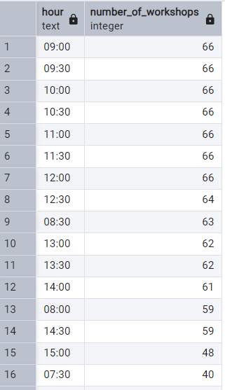
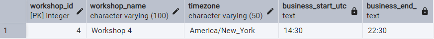

# <p align="center"> Advent of SQL 2024 🎄

A new advent calendar for all enthusiasts of SQL: https://adventofsql.com/.

I know SQL pretty well, but this kind of challenge is a good opportunity to learn something new or refresh my knowledge. I use a PostgreSQL database, version 17.2.

<br>

<p align="center"> 

<p align="center">

day | summary | important function
-- | -- |--
[day_0](day_00.sql) | practice using JOIN operations and aggregate functions | `JOIN`, `HAVING`, `WHERE`
[day_1](day_01.sql) | practice on how to work with JSON data in SQL | json `->>`, `JSON_ARRAY_LENGTH()`, `JOIN`
[day_2](day_02.sql) | practice ASCII encoding and character decoding | `ASCII()`, `CHR()`, `STRING_AGG()`
[day_3](day_03.sql) | explored XML parsing and handling arrays, this was new for me | xml `XPATH()`, `UNNEST()`
[day_4](day_04.sql) | practice working with arrays: calculating set complements and intersections; <br> second version using functions (this topic is new to me) | `ARRAY()`, `UNNEST()`, <br> `FUNCTION`
[day_5](day_05.sql) | practice with daily analysis and compare results day by day | `LAG()`, `LEAD()`
[day_6](day_06.sql) | practice working with simple aggregation functions | `AVG() OVER()`, `CTE`
[day_7](day_07.sql) | practice working with window_function | `ROW_NUMBER()` - unique sequential number, `RANK()` 
[day_8](day_08.sql) | used the RECURSIVE keyword in a CTE and applied it in practice for the first time | `CTE RECURSIVE`
[day_9](day_09.sql) | practice working with simple aggregation functions | `AVG()`, `CTE`,  `ROW_NUMBER() OVER()`
[day_10](day_10.sql) | practice using a pivot-like approach with conditional aggregation to transform rows into column | `CTE`, pivot
[day_11](day_11.sql) | practice working with window functions and calculating a moving average | Window functions
[day_12](day_12.sql) | practice using window functions and calculating percentiles | `PERCENT_RANK() OVER()`
[day_13](day_13.sql) | practice working with arrays | `UNNEST()`, `ARRAY_AGG()`, `SPLIT_PART()`
[day_14](day_14.sql) | practice working with array functions and  json functions | `jsonb_array_elements()`, json `->>`
[day_15](day_15.sql) | setting up PostGIS and working with geometry data | geometric types, `PostGIS`
[day_16](day_16.sql) | working with geometry data as in day 15 | geometric types, `PostGIS`, `LEAD()`, `LAG()`, `NULLS LAST`
[day_17](day_17.sql) | working with time zones  | `TIME ZONE`, `TO_CHAR()`
[bonus_17](day_17_bonus.sql) | working with time zones and generating a series | `TIME ZONE`, `TO_CHAR()`, `generate_series()`
[day_18](day_18.sql) | used the RECURSIVE keyword in a CTE and applied it similarly to the task from day 8 | `CTE RECURSIVE`, `COUNT() OVER()`
[day_19](day_19.sql) | practice working with arrays | ARRAY, `ARRAY_LENGTH()`
[day_20](day_20.sql) | working with JSON operations (extraction and transformation) | JSON, `JSON_OBJECT_AGG`

<br> 
<br>


## Bonus question

Because the main question for Day 17 doesn't have an answer, I changed it a little bit and added the results.

**Day 17 Main Question**: Find all possible 60-minute meeting windows where all participating workshops are within their business hours.

**Bonus Question**: Find the 60-minute time windows during which the maximum number of workshops can participate within their business hours. How many workshops need to change their business hours to create a meeting that includes all workshops?

```sql
WITH working_hours_in_utc AS (
	SELECT 
	    workshop_id,
		--convert business start and end times to UTC time zone
	    (TIMESTAMP '2024-12-19 ' + business_start_time) AT TIME ZONE timezone AT TIME ZONE 'UTC' AS business_start_utc,
	    (TIMESTAMP '2024-12-19 ' + business_end_time) AT TIME ZONE timezone AT TIME ZONE 'UTC' AS business_end_utc
	FROM Workshops
	),

workshop_hours AS (
	SELECT 
        workshop_id,
		--generate time slots (every 30 minutes) between business start and end times
		TO_CHAR(generate_series(
            business_start_utc, 
            business_end_utc - INTERVAL '1 second', 
            INTERVAL '30 minutes'), 'HH24:MI') AS hour
    FROM working_hours_in_utc
	)

SELECT 
--select time slots and count the number of workshops that can participate in each slot
	hour,
	COUNT(*) AS number_of_workshops
FROM workshop_hours
GROUP BY hour
ORDER BY number_of_workshops DESC, hour ASC;
```

The table `Workshops` contains information about the working hours of 67 workshops across the world. As a result of the query, between 9:00 UTC and 12:30 UTC, almost all (66 out of 67) workshops are available during their working hours. The time window between 9:00 and 12:30 UTC will be the best time to schedule the meetings.

<p align="center"> 

The one workshop that doesn't operate within this time frame is Workshop 4, which is located in New York and operates between 14:30 and 22:30 UTC.

<p align="center"> 

The best option to schedule the meeting for all workshops is to choose the time between 11:30 and 12:30. For 66 out of 67 workshops, they will be able to participate in that meeting during their business hours. The workshop in New York, however, should exceptionally start working 3 hours earlier than usual on that day. This means that on that day, the workshop in New York should start working at 6:30 AM local time.


<br/>

*** 

 # <p align="center"> Thank you for your attention! 🫶️

**Thank you for reading.** If you have any comments on my work, please let me know. My email address is ela.wajdzik@gmail.com.

***


