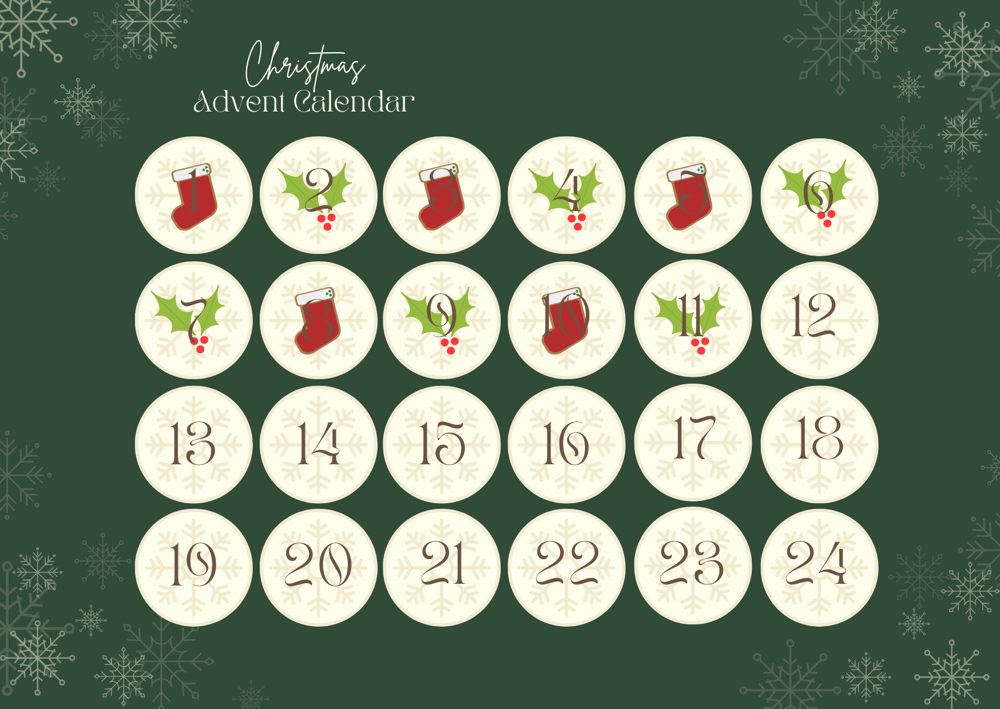

# 
 Advent of SQL 2024 🎄

A new advent calendar for all enthusiasts of SQL: https://adventofsql.com/.

I know SQL pretty well, but this kind of challenge is a good opportunity to learn something new or refresh my knowledge. I use a PostgreSQL database, version 17.2.

 

 

day | summary | important function
-- | -- |--
[day_0](day_00.sql) | practice using JOIN operations and aggregate functions | `JOIN`, `HAVING`, `WHERE`
[day_1](day_01.sql) | practice on how to work with JSON data in SQL | json `->>`, `JSON_ARRAY_LENGTH()`, `JOIN`
[day_2](day_02.sql) | practice ASCII encoding and character decoding | `ASCII()`, `CHR()`, `STRING_AGG()`
[day_3](day_03.sql) | explored XML parsing and handling arrays, this was new for me | xml `XPATH()`, `UNNEST()`
[day_4](day_04.sql) | practice working with arrays: calculating set complements and intersections;   second version using functions (this topic is new to me) | `ARRAY()`, `UNNEST()`,   `FUNCTION`
[day_5](day_05.sql) | practice with daily analysis and compare results day by day | `LAG()`, `LEAD()`
[day_6](day_06.sql) | practice working with simple aggregation functions | `AVG() OVER()`, `CTE`
[day_7](day_07.sql) | practice working with window_function | `ROW_NUMBER()` - unique sequential number, `RANK()` 

 

*** 

 # 
 Thank you for your attention! 🫶️

**Thank you for reading.** If you have any comments on my work, please let me know. My email address is ela.wajdzik@gmail.com.

***

